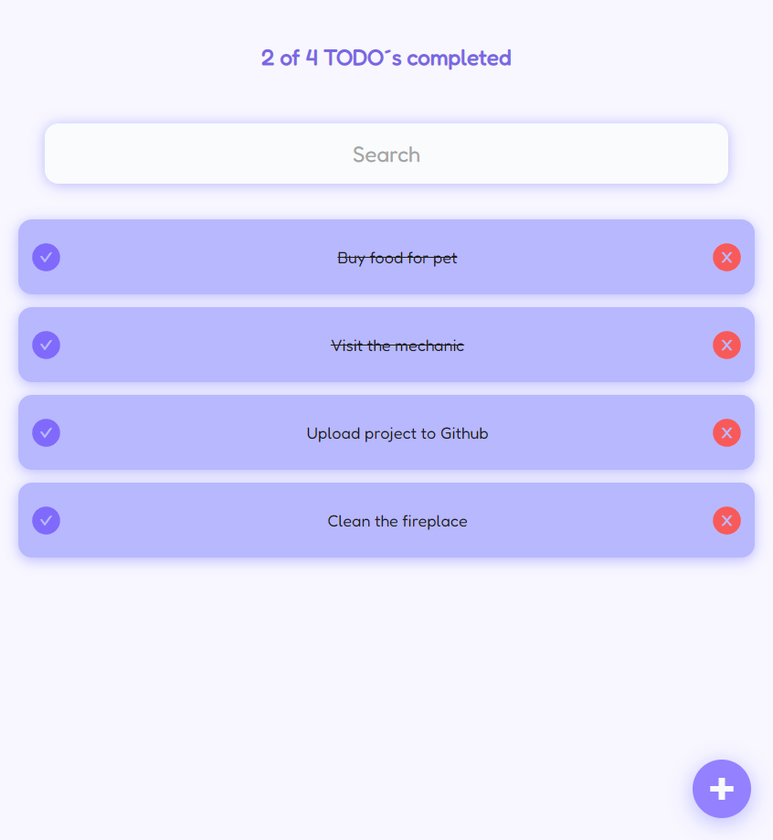
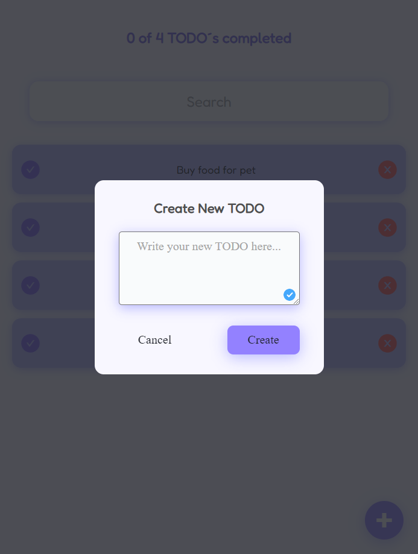
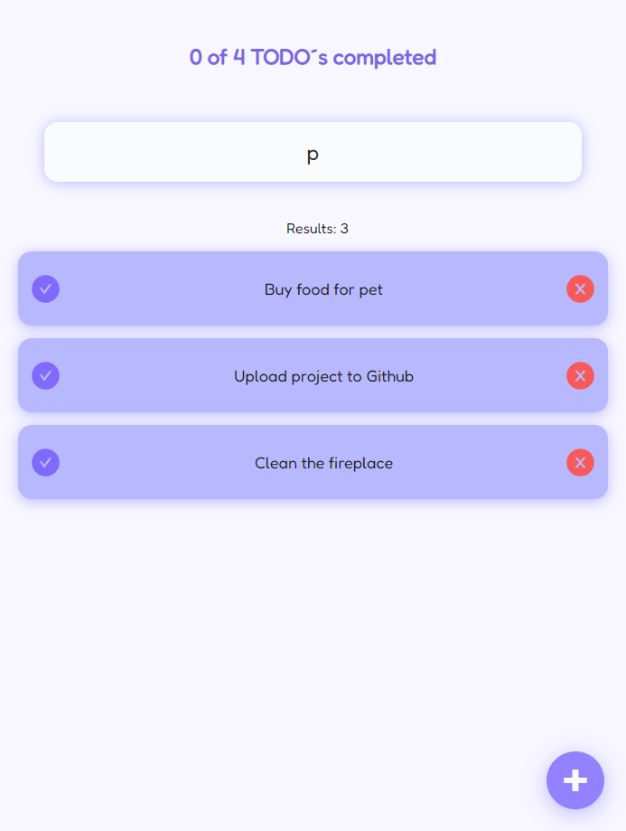

# TODO app

This projects is about to build a simple app to create tasks to do in cards, where you can mark as completed or delete them besides to filter by their names.

## Libraries
- React
- Fontawesome

